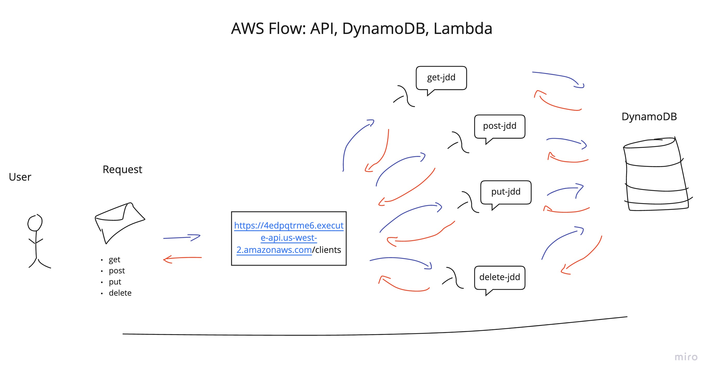

# dynamo-put-jdd

## Task

- Create a single resource REST API using a domain model of your choosing, constructed using AWS Cloud Services
- Your functions will need to be individually .zipped and deployed using common libraries (node_modules) and schema files.

## Root URL to API

[Root URL](https://4edpqtrme6.execute-api.us-west-2.amazonaws.com)

## Routes

- /clients

## Inputs

- The schema of the DynamoDB table looks like the following:

```javascript
const clientsSchema = new dynamoose.Schema({
  id: String,
  name: String,
  phone: String
})

```

### .post()

- make a `POST` request to the `/clients` route to create a user
- requires a `name` and `phone` key and value pairs as part of the request body
- the id is auto generated by node package `uuid.v4`

```javascript
{
  "name": "John Doe",
  "phone": "555-5555
}
```

- OUTPUT:

```javascript
{
  "name": "John Doe",
  "phone": "555-5555
}
```

### .get()

#### Single Client

- make a `GET` request to the `/clients` route along with an id number as a query parameter to retrieve an individual client

`https://4edpqtrme6.execute-api.us-west-2.amazonaws.com/clients?id=#######-####-########`

- OUTPUT:
  - The output will be the client's information

```javascript
{
  "name": "John Doe",
  "phone": "555-5555
}
```

#### All Clients

- make a `GET` request to the `/clients` route without any query parameters to retrieve all the clients within the DynamoDB

- OUTPUT:
  - The output will be either a list of clients

### .put()

- make a `PUT` request to the `/clients` route along with an id number as a query parameter to update a client
  - this id will be used update the user with the specified id

`https://4edpqtrme6.execute-api.us-west-2.amazonaws.com/clients?id=#######-####-########`

- requires a `name` OR `phone` key and value pairs as part of the request body
  - these values will be used to update the selected users information

```javascript
{
  "name": "Updated name goes here",
}

{
  "phone": "Updated a phone number"
}

{
  "name": "Updated name goes here",
  "phone": "Updated a phone number"
}
```

- OUTPUT:
  - The user will be notified that the user with the specified ID has been updated

### .delete()

- make a `DELETE` request to the `/clients` route along with an id number as a query parameter to delete a client

`https://4edpqtrme6.execute-api.us-west-2.amazonaws.com/clients?id=#######-####-########`

- OUTPUT:
  - The user will be notified that the user with the specified ID has been deleted


